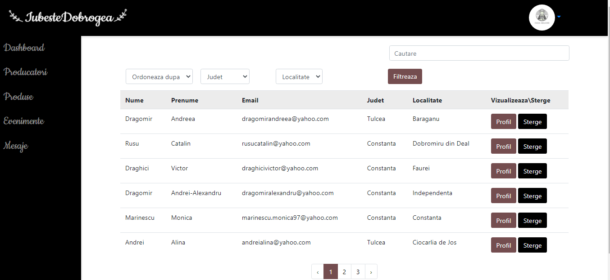

# IubesteDobrogea - Laravel Application

## Overview

<p style="text-indent: 20px;">This is a Laravel application designed to promote local producers in the Dobrogea region, Romania. The application proves my skills in web development.</p>

## Table of Contents

- [Requirements](#requirements)
- [Installation](#installation)
- [Configuration](#configuration)
- [Description](#description)
- [Usage](#usage)
- [Database](#database)
- [License](#license)

## Requirements

- PHP >= 7.3
- Composer
- Laravel >= 8.x
- MySQL
- Node.js & npm

## Installation

1. **Clone this repository to your local machine:**
    ```sh
   git clone https://github.com/marinescu97/IubesteDobrogea.git
   ```
   ```sh
   cd IubesteDobrogea
   ```
2. **Install laravel**
    ```sh
    composer global require laravel/installer
    ```
3. **Install PHP dependencies:**
    ```sh
    composer install
    ```
4. **Install Node dependencies:**
    ```sh
      npm install
    ```
5. **Generate application key:**
    ```sh 
      php artisan key:generate
    ```
   
## Configuration

1. **Set up the MySQL database:**

   Create a new database.

2. **Configure the .env file:**

   Open the .env file and update the database settings.


3. **Run migrations and seed the database:**

    ```sh 
      php artisan migrate --seed
    ```
   
4. **Start the development server:**
    
    ```sh 
      php artisan serve
    ```
   
5. **Access the application:**

   Open your web browser and go to http://localhost:8000 to see the application in action.

## Description 
<p style="text-indent: 20px;">IubesteDobrogea has designed a range of features depending on the roles that might be useful for the application's usage.</p>

<p style="text-indent: 20px; font-weight: bold;">The application should allow all users to:</p>

* Create an account
* View the list of registered producers
* View a producer's profile
* View the list of products
* View information about a product
* View the list of events
* View details about an event
* View announcements of an event
* Send a message to the platform, except the administrator.

<br>
<p style="text-indent: 20px; font-weight: bold;">Producers should be allowed to:</p>

* Modify their own data
* Deactivate the account
* Add products
* Delete their own products
* Add events
* Add announcements to events
* Delete their own announcements

<br>
<p style="text-indent: 20px; font-weight: bold;">The administrator should be allowed to:</p>

* Add events
* Delete producers
* Delete products
* Delete events
* Delete event announcements

## Usage

<p style="text-indent: 20px;">After IubesteDobrogea is set up, you can use it based on your role: 'Admin', 'Producer', or 'Guest'. Here is a quick guide on using the application.</p>
<p style="text-indent: 20px;">When the user accesses the platform, it opens with the main page, the "Acasa" ("Home") page. The page contains some suggestive images, along with an introduction and a few words for visitors and producers.</p>


<p style="text-indent: 20px;">If the user has an account, he can log in by accessing the link "Conectare" and will be redirected to the login page. This page contains a form in which it is necessary to enter the data, for the user to authenticate successfully.</p>


<p style="text-indent: 20px;">If there is a new producer who accesses the application and wants to make an account, he can do it by pressing the button "Utilizator nou?" and will be redirected to the page which contains the registration form. For registration, it is necessary to enter the data required. If these data are valid, the user is authenticated and redirected to the page
"Profil", otherwise an error message will be displayed.</p>


<p style="text-indent: 20px;">Once registered, the user's profile picture will appear in the navigation bar, on the right side, together with a menu containing all his permissions. The user has the right to view his profile, add a product, add an event and change his own data.</p>


<p style="text-indent: 20px;">The user's profile contains all his data, and can be modified by accessing the link
"Setari profil". Thus the user will be redirected to a page that displays a form. The form already contains the existing data, so there is no need
entering all the data.</p>


<p style="text-indent: 20px;">This form also contains the option to delete the account. To avoid unintentional deletion of the account, it will be shown a window through which the user must confirm the continuation of the deletion process.</p>


<p style="text-indent: 20px;">The form for adding products allows producers to add as many images as they want. They can also preview inserted images to avoid loading unintentional use of images that are not related to the respective product.</p>


<p style="text-indent: 20px;">If the user wants to add an event, he can do it by accessing the "Adauga un eveniment" link from the profile image menu.</p>
<p style="text-indent: 20px;">The following form allows him to add a title, the date and time when the respective event starts, the county and town where it will take place and its details, which consist of a
image and a description. The fields for entering the details are made in this way the user can enter as many details as he want. Thus, pressing the "+" button will
display in real time another set of fields for entering details, and to delete them will press the "-" button.</p>
<p style="text-indent: 20px;">To successfully add an event, it is necessary to add all the information about it. The information must be correct, otherwise an error message will be displayed. For example, the date field must contain a date greater than today's.</p>


<p style="text-indent: 20px;">The three pages, respectively "Producatori", "Produse" and "Evenimente", can be viewed
by all users of the platform, regardless of role.</p>
<p style="text-indent: 20px;">The "Producatori" page contains a list of cards with all producers' information. If users want to search for a specific producer, they can do so by entering the respective word in the search box. This allows searching for producers by first name, last name, county or town. By pressing the button "View profile" of the user a page with the producer's data will appear.</p>


<p style="text-indent: 20px;">The "Produse" page contains the list of products displayed according to the users' wishes. When you first access the page, the products are displayed in the order they were added. Users can search for the desired products in the box above them or you can choose to display them according to the chosen category
from the list on the left.</p>

<p style="text-indent: 20px;">By pressing the "View" button, the user can visit the page of each product. Here
you can find information specific to each one, as well as information about the producer who owns
the respective product.</p>


<p style="text-indent: 20px;">The "Evenimente" page contains a list of all events added by producers or by administrator. As in the case of the previous pages, the events can be searched by title, start date or time, county or town.</p>


<p style="text-indent: 20px;">On the page of the chosen event, next to the details, users can view the added announcements of producers in order to inform them.</p>


<p style="text-indent: 20px;">Once registered, the administrator can access his own pages. The first is "Dashboard" page. Here is some information about the data added to the application. In the the following example observes the number of producers, products and events,
and below there are two diagrams showing the percentage of each producer in according to each county and the percentage of each product according to each category.</p>


<p style="text-indent: 20px;">The administrator has permission to delete each producer, product or event.
These are displayed in the form of tables, and he can order them according to a chosen element from the list, to look for them by an element in the table or to group them by county or town. In the the next example is the table in which the producers are displayed.</p>



## Database

The application uses a MySQL database to store and manage users, products, and events. Below is a visual representation of the database structure:


## License
The IubesteDobrogea application is distributed under the [MIT License](https://opensource.org/license/mit). 
